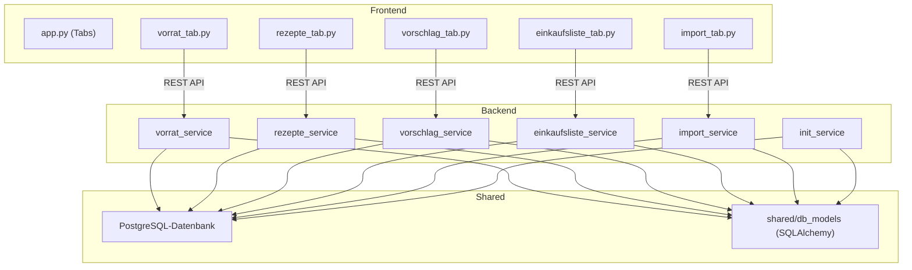
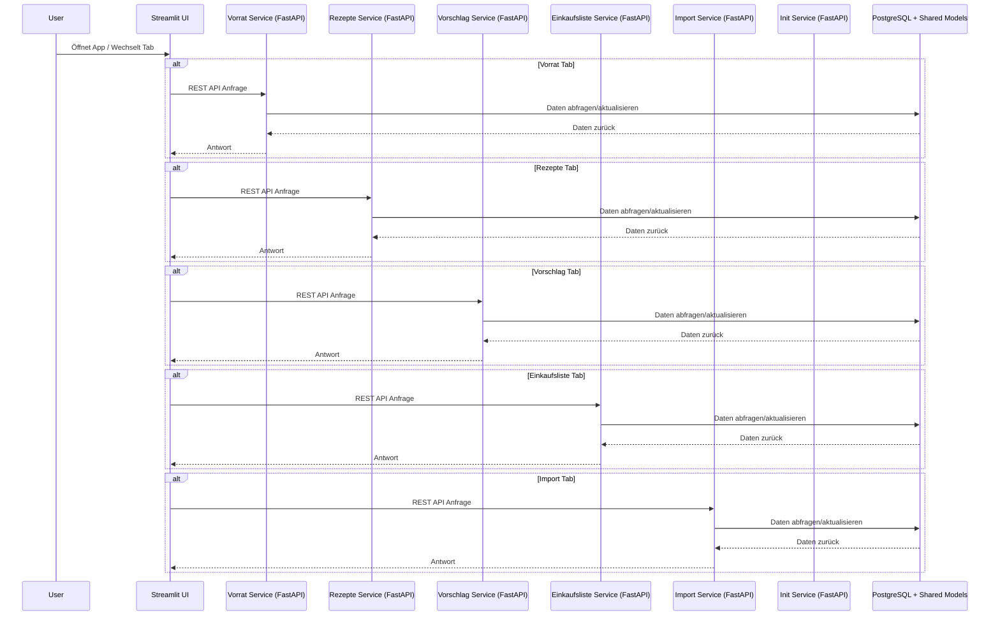
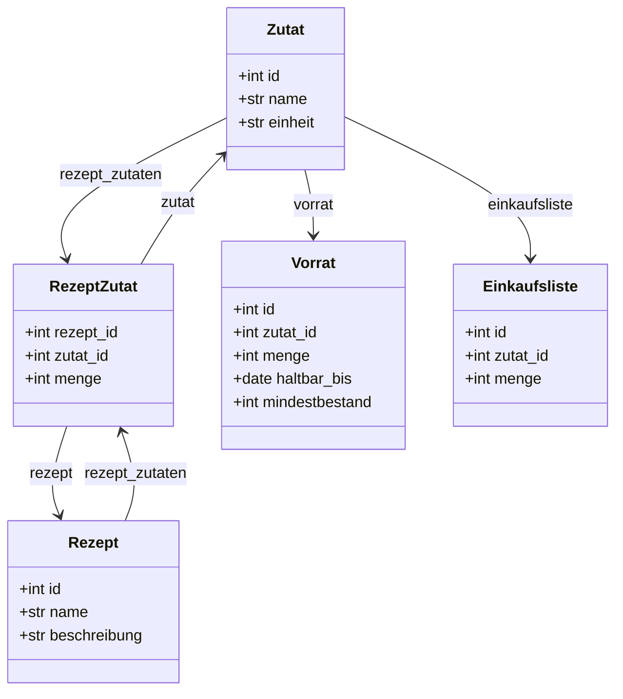
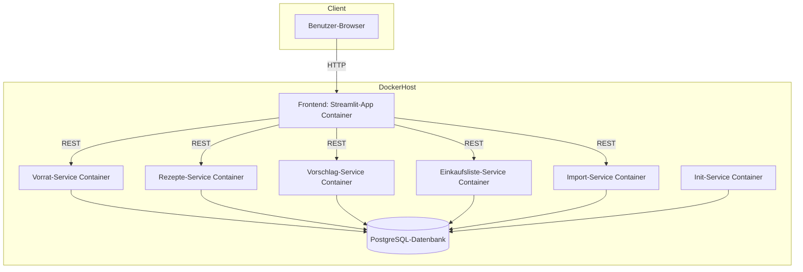

# 🥘 Digitale Kochbuch-App mit integrierter Vorratsverwaltung und REST-API Services

Willkommen bei deiner digitalen Kochbuch-App!  
Diese Anwendung basiert jetzt auf einer **vollständig REST-API-basierten Microservice-Architektur**, realisiert mit **FastAPI** und **Pydantic**. Jeder Tab der App läuft als eigenständiger Microservice in einem separaten Docker-Container, was die Wartbarkeit erheblich verbessert und die Fehlertoleranz steigert.

Du profitierst dadurch von modularer Funktionalität, besserer Skalierbarkeit und einer klaren Trennung der Komponenten.

Die App bietet weiterhin eine moderne und intuitive Benutzeroberfläche zur Verwaltung von Rezepten und Vorräten.

- Entwickelt mit **Python** und **Streamlit**
- Speicherung aller Daten in einer **PostgreSQL-Datenbank**
- Verwaltung der Datenbank mit **SQLAlchemy** und **Docker**
- Integration eines **ChatGPT-gestützten Import-Systems**: Rezepte können bequem aus Bildern oder Webseiten automatisch extrahiert werden  
- **Modularer Microservice-Ansatz:** Jeder Tab kommuniziert über REST-APIs, umgesetzt mit **FastAPI** und **Pydantic**, ausgeführt in isolierten Docker-Containern

---

## 🚀 Features

- 🧺 **Vorratsverwaltung:** Behalte den Überblick über Zutaten, Bestände und Haltbarkeitsdaten
- 📖 **Rezeptverwaltung:** Hinzufügen, Bearbeiten und Anzeigen von Rezepten
- 🔄 **Integration:** Verknüpfung von Rezepten mit aktuellen Vorratsdaten
- 🧠 **Intelligenter Import:** OCR- und LLM-gestütztes Erfassen neuer Rezepte
- 🛒 **Einkaufslisten-Generator:** Automatische Erstellung basierend auf Vorräten und Rezeptbedarf
- 🐳 **Containerisiert:** Vollständige Bereitstellung via Docker für einfaches Setup

---

## 🛠️ Tech-Stack

| Komponente       | Beschreibung                         |
|------------------|--------------------------------------|
| 🐍 Python         | Programmiersprache der Wahl          |
| 🌐 Streamlit      | Web-Interface für die Anwendung      |
| ⚡ FastAPI         | Framework für Microservice-APIs      |
| 📦 Pydantic       | Datenvalidierung und -modellierung   |
| 🐘 PostgreSQL     | Datenbank für Rezepte & Vorräte      |
| 🧪 SQLAlchemy     | ORM für effiziente Datenbankzugriffe |
| 🐳 Docker         | Containerisierung & Setup-Management |

---

## 📚 Ziel

Verwalte deine Küche einfach, modern und effizient – entdecke, plane und organisiere deine Rezepte und Vorräte an einem Ort!

---

## 🧱 Projektstruktur (grober Überblick)

```bash
Kochbuch-App/
├── frontend/                   ← Streamlit UI
│   ├── app.py                  ← Hauptseite mit Tabs
│   ├── requiremnts.txt         ← requirments für das Frontend
│   ├── Dockerfile
│   └── tabs/
│       ├── vorrat_tab.py       ← REST-basierter Tab (spricht Service)
│       ├── rezepte_tab.py
│       ├── vorschlag_tab.py
│       ├── einkaufsliste_tab.py
│       └── import_tab.py
│ 
│
├── services/                   ← Jeder Dienst ist ein Microservice
│   ├── init_services/
│   │   ├── init_db.py          ← initialsierung der Grundzuteten und eines Testrezeptes
│   │   └── Dockerfile
│   ├── vorrat_service/
│   │   ├── main.py             ← FastAPI-Server für Vorrat
│   │   ├── Dockerfile
│   │   └── requirements.txt
│   ├── rezept_service/         ← sinngemäßer Aufbau wie vorrat_service
│   ├── vorschlag_service/
│   ├── einkaufsliste_service/
│   └── rezept-import_service/  
│
│
├── shared/                     ← geteilte SQLAlchemy-Modelle und Skrips
│   ├── db_models/
│   │   ├── base.py
│   │   ├── einkaufsliste.py
│   │   ├── rezept_zutat.py
│   │   ├── rezept.py
│   │   ├── vorrat.py
│   │   └── zutat.py
│   ├── scripts
│       └── wit-for-it.sh
│   ├── config.py                ← Konfiguration der Database 
│   ├── database.py              ← Initialisierung der Database 
│   └── utils.py                 ← Helper Funktionen 
│
├── docker-compose.yml         ← Zum Hochfahren aller Services + DB  
├── .env                       ← API-Keys, DB-URL, Secrets
├── templates.py               ← Templates für Icons
├── LICENSE
└── README.md
```

---
## 🐳 Deployment mit Docker: Microservice-Architektur & Netzwerk

Diese Anwendung verwendet eine **Microservice-Architektur**, bei der jede Komponente (Frontend und Backend-Services) in einem eigenen **Docker-Container** läuft. Alle Container sind über ein gemeinsames Docker-Netzwerk verbunden, was die interne Kommunikation stabil und sicher macht.

---

### 📦 Services als Container

Jede der folgenden Komponenten wird in einem separaten Container betrieben:

| Service                  | Beschreibung                                 |
|--------------------------|----------------------------------------------|
| `frontend`               | Streamlit-UI mit Tabs für die Webanwendung   |
| `init_service`           | Datenbank-Service für Initialisierung von Grundzutaten und eines Testrezeptes, wird nach inplemtierung wieder beendet       |
| `vorrat_service`         | FastAPI-Service für Vorratsverwaltung        |
| `rezepte_service`        | FastAPI-Service für Rezepteverwaltung        |
| `vorschlag_service`      | FastAPI-Service für Rezeptvorschläge         |
| `einkaufsliste_service`  | FastAPI-Service für Einkaufsliste            |
| `import_service`         | FastAPI-Service zum Datenimport              |
| `postgres`               | PostgreSQL-Datenbank für alle Services       |

---

### 🔗 Gemeinsames Docker-Netzwerk

Alle Services sind über ein benutzerdefiniertes Docker-Netzwerk (z. B. `app_net`) miteinander verbunden:

- Ermöglicht **sichere Kommunikation** zwischen Containern
- **DNS-basiertes Service-Discovery** (`http://rezepte_service:8000`)
- Kein externer Zugriff nötig – alles bleibt **intern und isoliert**


## ✅ Vorteile der Docker-basierten Microservice-Architektur

Die gewählte Architektur bringt zahlreiche Vorteile für Entwicklung, Deployment und Betrieb:

### 🔄 Skalierbarkeit
- Jeder Microservice kann **unabhängig skaliert** werden – horizontal (mehr Instanzen) oder vertikal (mehr Ressourcen).
- Ermöglicht eine **bedarfsorientierte Ressourcenverteilung** bei hoher Last (z. B. mehr Vorschlagsdienste bei komplexer Logik).

### 🌍 Verteilbarkeit
- Jeder Service kann theoretisch auf einem **eigenen Server** oder **in der Cloud** betrieben werden.
- Bereit für **Docker Swarm**, **Kubernetes** oder andere Orchestrierungsplattformen.
- Erleichtert den **globalen Betrieb** durch georedundante Verteilung.

### 🔗 Isolation & Unabhängigkeit
- Services sind voneinander isoliert – Fehler in einem Service wirken sich nicht direkt auf andere aus.
- Unabhängiges **Entwickeln, Testen, Deployen** möglich.

### 🧩 Modularität & Wartbarkeit
- Die Anwendung ist in **logisch getrennte Komponenten** gegliedert.
- Neue Funktionen lassen sich als eigenständige Services integrieren.
- Änderungen in einem Bereich erfordern **keine Anpassungen an anderen** Services.

### 🧪 Einheitliche Umgebung
- Alle Services laufen in **identisch definierten Containern** – auf jedem System gleich.
- Verhindert „It works on my machine“-Probleme.
- Vereinfachtes Onboarding für neue Entwickler.

### 🔐 Sicherheit & Netzwerktrennung
- Kommunikation erfolgt nur über das **interne Docker-Netzwerk**.
- Kein unnötiger Zugriff von außen auf interne APIs.
- Dienste können gezielt nach außen freigegeben oder abgeschottet werden.

---

Diese Architektur ist eine robuste Grundlage für **wachstumsfähige**, **wartbare** und **zukunftssichere** Webanwendungen.

---

## 1. Klone das Repository
git clone https://github.com/EikAlex/Kochbuch-App.git

cd Cocking-App

## 2. Starte die Anwendung
docker-compose up --build (<Docker 20.10)

docker compose up --build

Falls die Datenbank langsamer startet als die Web-App und wait-for-it.sh nicht korrekt greift, kannst du mit Strg + C abbrechen und anschließend neu starten.
Dieses Vorgehen ist nur nötig, wenn wait-for-it.sh Verbindungsprobleme zur Datenbank verursacht.

## 3. Link zur Webapp
http://localhost:8501/

## 4. Neustart und leeren der Datenbank
docker compose down

docker volume rm kochbuch-app_pgdata

## 5. Nutzen der Rezept-Import
Um die Rezept-Import Funktion nutzen zu können muss in .env,
eine datei mit API-Key angelgt werden.

```bash
[openai]
openai_api_key = "sk -xxxxxxxxx"
```
---
## Diagramme 
---
### Architekturdiagramm/Komponentendiagramm

---
### Sequenz-Diagramm


---
### Klassen-Diagramm

---
###  Deployment-Diagramm (Docker-Architektur)



---
## Erstellt von Alexander Schmal für die Abgabe des Mobile Applikationen Moduls 
