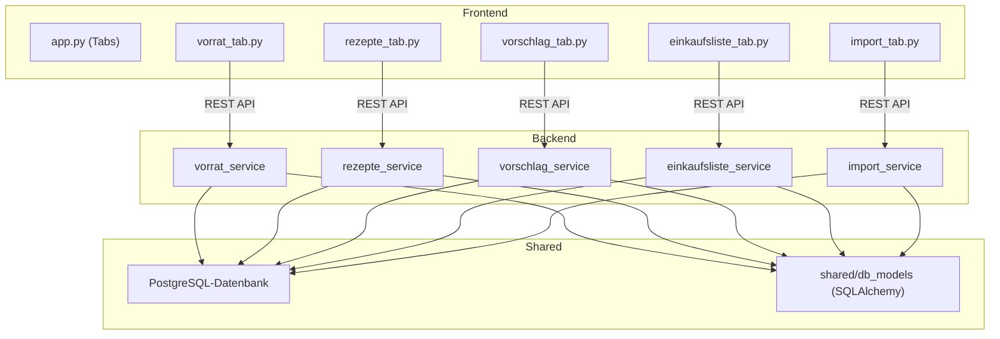
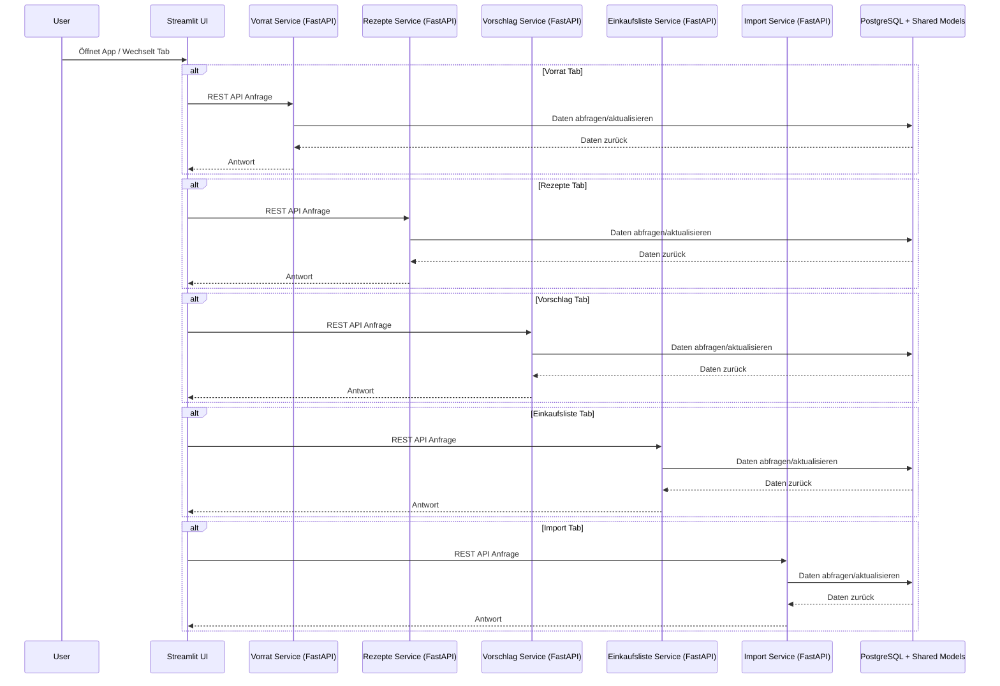

# 🥘 Digitale Kochbuch-App mit integrierter Vorratsverwaltung

Willkommen bei deiner digitalen Kochbuch-App!  
Diese Anwendung basiert jetzt auf einer **vollständig REST-API-basierten Microservice-Architektur**, realisiert mit **FastAPI** und **Pydantic**. Jeder Tab der App läuft als eigenständiger Microservice in einem separaten Docker-Container, was die Wartbarkeit erheblich verbessert und die Fehlertoleranz steigert.

Du profitierst dadurch von modularer Funktionalität, besserer Skalierbarkeit und einer klaren Trennung der Komponenten.

Die App bietet weiterhin eine moderne und intuitive Benutzeroberfläche zur Verwaltung von Rezepten und Vorräten.

- Entwickelt mit **Python** und **Streamlit**
- Speicherung aller Daten in einer **PostgreSQL-Datenbank**
- Verwaltung der Datenbank mit **SQLAlchemy** und **Docker**
- Integration eines **ChatGPT-gestützten Import-Systems**: Rezepte können bequem aus Bildern oder Webseiten automatisch extrahiert werden  
- **Modularer Microservice-Ansatz:** Jeder Tab kommuniziert über REST-APIs, umgesetzt mit **FastAPI** und **Pydantic**, ausgeführt in isolierten Docker-Containern

---

## 🚀 Features

- 🧺 **Vorratsverwaltung:** Behalte den Überblick über Zutaten, Bestände und Haltbarkeitsdaten
- 📖 **Rezeptverwaltung:** Hinzufügen, Bearbeiten und Anzeigen von Rezepten
- 🔄 **Integration:** Verknüpfung von Rezepten mit aktuellen Vorratsdaten
- 🧠 **Intelligenter Import:** OCR- und LLM-gestütztes Erfassen neuer Rezepte
- 🛒 **Einkaufslisten-Generator:** Automatische Erstellung basierend auf Vorräten und Rezeptbedarf
- 🐳 **Containerisiert:** Vollständige Bereitstellung via Docker für einfaches Setup

---

## 🛠️ Tech-Stack

| Komponente       | Beschreibung                         |
|------------------|--------------------------------------|
| 🐍 Python         | Programmiersprache der Wahl          |
| 🌐 Streamlit      | Web-Interface für die Anwendung      |
| ⚡ FastAPI         | Framework für Microservice-APIs      |
| 📦 Pydantic       | Datenvalidierung und -modellierung   |
| 🐘 PostgreSQL     | Datenbank für Rezepte & Vorräte      |
| 🧪 SQLAlchemy     | ORM für effiziente Datenbankzugriffe |
| 🐳 Docker         | Containerisierung & Setup-Management |

---

## 📚 Ziel

Verwalte deine Küche einfach, modern und effizient – entdecke, plane und organisiere deine Rezepte und Vorräte an einem Ort!

---

## 🧱 Projektstruktur (grober Überblick)

```bash
Cocking-App/
├── frontend/                   ← Streamlit UI
│   ├── app.py                  ← Hauptseite mit Tabs
│   └── tabs/
│       ├── vorrat_tab.py       ← REST-basierter Tab (spricht Service)
│       ├── rezepte_tab.py
│       ├── vorschlag_tab.py
│       ├── einkaufsliste_tab.py
│       └── import_tab.py
│ 
├── scripts
│   └── wit-for-it.sh
│
├── services/                   ← Jeder Dienst ist ein Microservice
│   ├── vorrat_service/
│   │   ├── main.py             ← FastAPI-Server für Vorrat
│   │   ├── database.py         ← DB-Session + Config
│   │   ├── Dockerfile
│   │   └── requirements.txt
│   ├── rezepte_service/        ← sinngemäß wie vorrat_service
│   ├── vorschlag_service/
│   ├── einkaufsliste/
│   └── import_service/  
│
├── old                         ← älteres Modell der App, vor integration der Services
│   ├── db.py
│   ├── Dockerfile
│   ├── ini_db.py
│   ├── llm_import.py
│   ├── main.py
│   ├── models.py
│   ├── requirements.txt
│   ├── templates.txt
│   └── util.py
|
├── shared/                    ← geteilte SQLAlchemy-Modelle
│   └── db_models/
│       ├── base.py
│       ├── einkaufsliste.py
│       ├── rezept_zutat.py
│       ├── rezept.py
│       ├── vorrat.py
│       └── zutat.py
│
├── docker-compose.yml         ← Zum Hochfahren aller Services + DB  
├── .env                       ← API-Keys, DB-URL, Secrets
├── secrets.toml               ← API-Key für OpenAI
├── LICENSE
└── README.md
```
---
## 1. Klone das Repository
git clone https://github.com/EikAlex/Cocking-App.git

cd Cocking-App

## 2. Starte die Anwendung
docker-compose up --build 

Falls die Datenbank langsamer startet als die Web-App und wait-for-it.sh nicht korrekt greift, kannst du mit Strg + C abbrechen und anschließend neu starten.
Dieses Vorgehen ist nur nötig, wenn wait-for-it.sh Verbindungsprobleme zur Datenbank verursacht.

## 3. Link zur Webapp
http://localhost:8501/

## 4. Neustart und leeren der Datenbank
docker-compose down

docker volume rm cocking-app_pgdata

## 5. Nutzen der Rezept-Import
Um die Rezept-Import Funktion nutzen zu können muss in app/.streamlit/secrets.toml,
eine datei mit API-Key angelgt werden.

```bash
[openai]
openai_api_key = "sk -xxxxxxxxx"
```

### Diagramme und FlowChars
---
## Architekturdiagramm/Komponentendiagramm

---
## Sequenz-Diagramm


---
### Erstellt von Alexander Schmal für die Abgabe des Mobile Applikationen Moduls 
